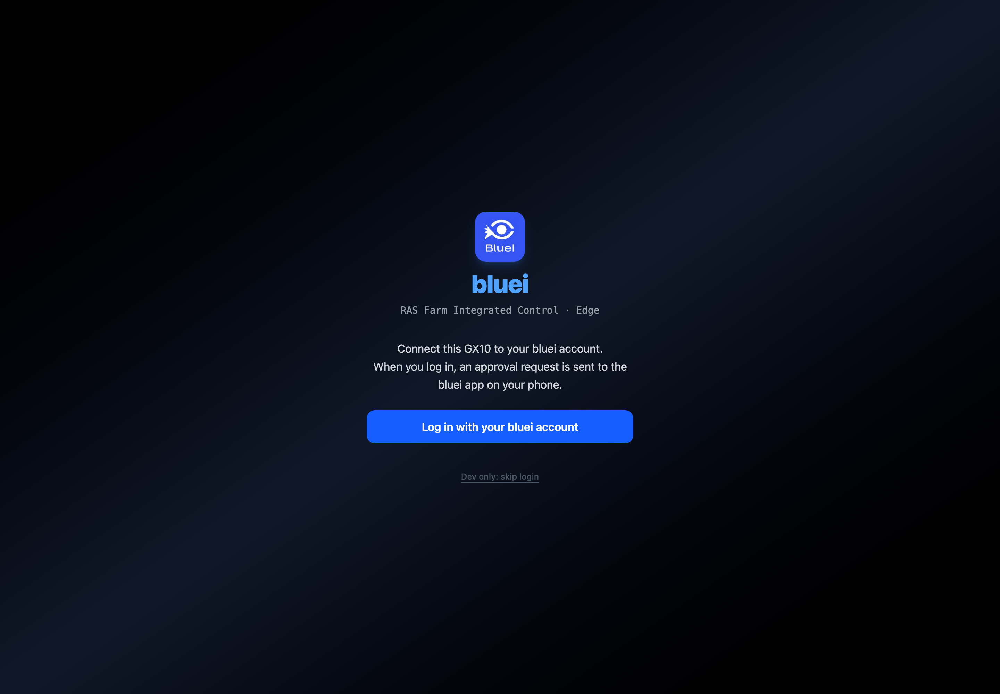
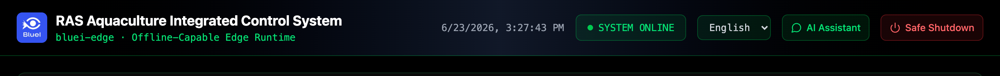

# Access & Login

## Open the dashboard

On any device on the **same network** as the GX10, open a browser and go to:

```
http://<edge-ip>:8080/
```

Replace `<edge-ip>` with the GX10's IP address on your LAN. The dashboard and its API are
served from the same address, so no extra setup is needed on the browser side.

> ℹ️ If the GX10 has a desktop, the dashboard may also open automatically in its own
> window — you do not have to use a separate browser in that case.

## Sign in with phone approval

Logging in links **this GX10** to your **bluei account** and is approved from your phone.

1. On the login screen, select **① Log in with your bluei account**.
2. The dashboard shows a **② approval number** and "Waiting for approval…".
3. Open the **bluei app on your phone**, find the matching number, and **approve** it.
4. On approval, the screen shows **Connected** and the dashboard loads.



If approval is **denied** or the request **expires**, the screen explains what happened —
select **Try again** to restart. A network problem shows
"Login request failed. Please check your network."

## Read the screen layout

After login, the **header bar** (always visible at the top) is your control strip:

- **① System status** — `SYSTEM ONLINE` indicates the backend is healthy.
- **② Language** — switch **English** / **한국어**; remembered on this browser.
- **③ AI Assistant** — opens the operations help panel (see *System Operations*).
- **④ Safe Shutdown** — safely stops the backend **right before powering off** the GX10
  (see *System Operations* — do not use this casually).



Below the header are the **Farm / Site selectors** and the four main tabs:

| Tab | Purpose |
|-----|---------|
| **Site Tank Management** | Group & tank status, production overview, feeding cycles |
| **AI Management** | Operating policy, inference, on-site training, learned safety, controllers, admin |
| **Production & Events** | Mortality, treatment, transfer, and other records |
| **Stocking · Shipping · Buyers** | Stocking, shipping, buyers, and trade documents |

> ℹ️ The first time you open the dashboard, most panels are empty — that is expected.
> Continue to **Initial Setup** to register your farm, site, and tanks.

---

**Navigation:** [← Overview](00-overview.md) · [📖 Contents](../index.md) · [Initial Setup →](02-initial-setup.md)
