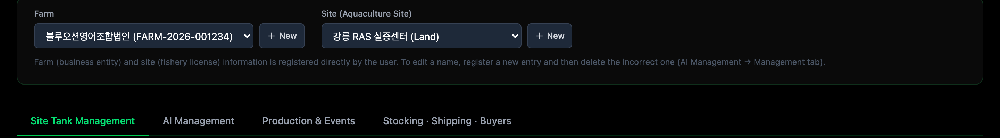
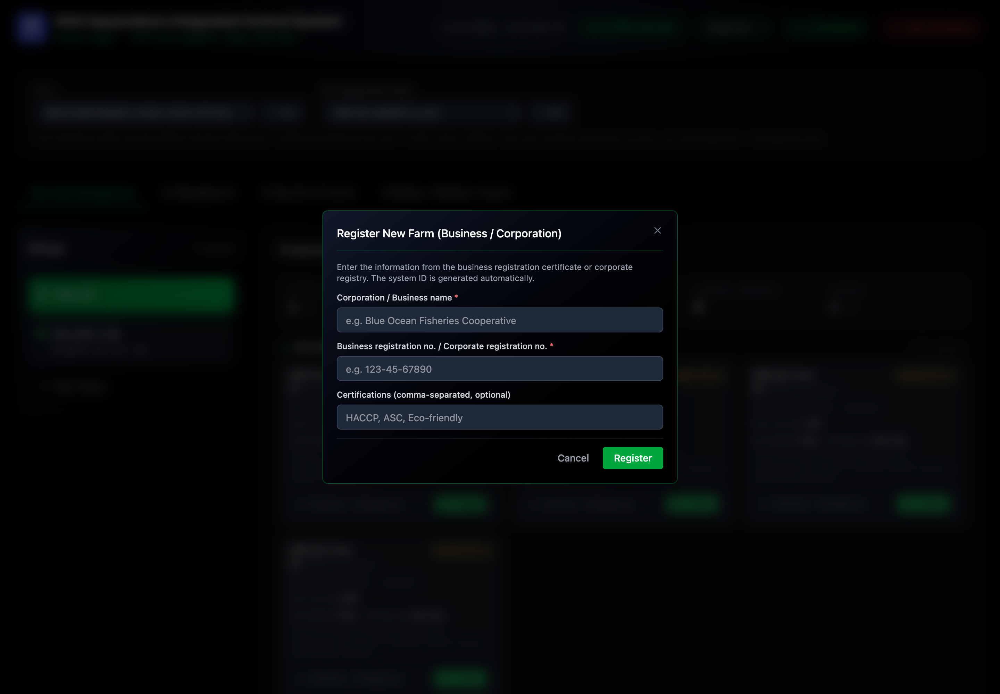
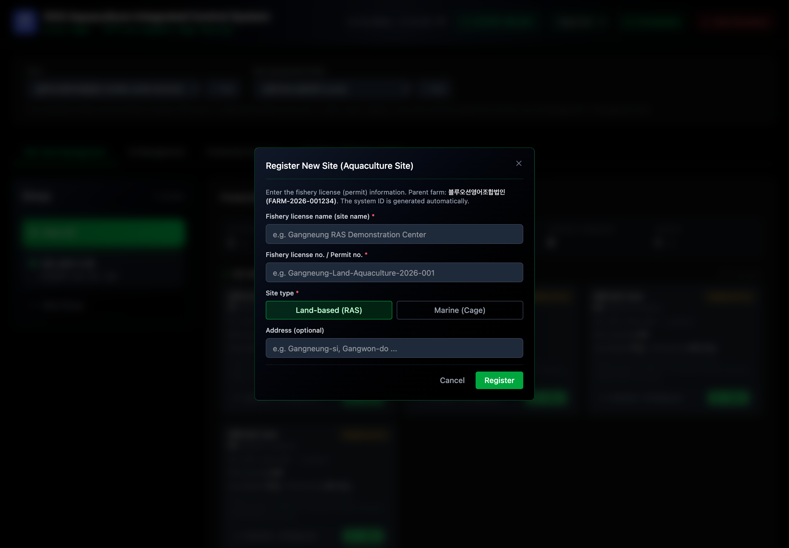
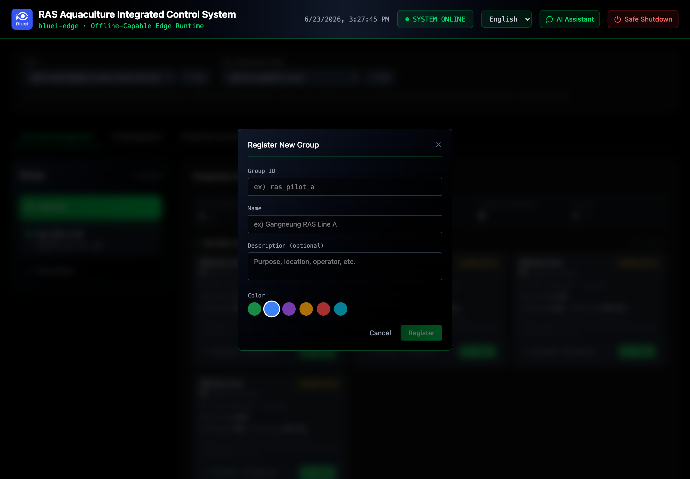
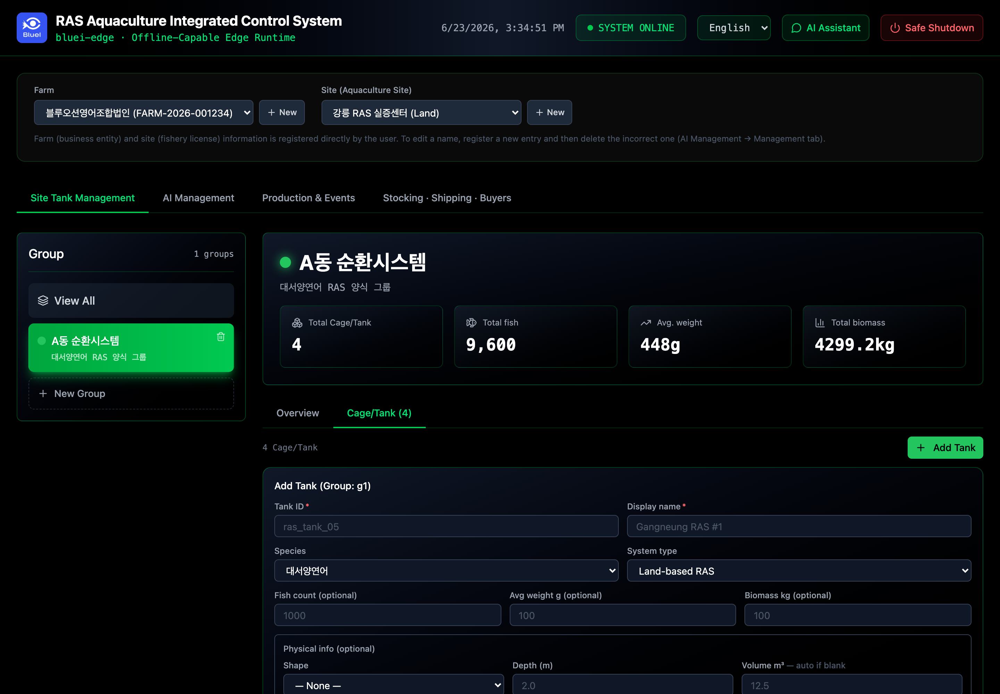

# Initial Setup (one-time)

Do this once when commissioning a site. The order matters: each step builds on the
previous one (a tank belongs to a group; a sensor maps to a tank; stocking fills a tank).

> ℹ️ Names you enter here (farm name, site name, group name) are **your data** and are
> shown as-typed in both languages — only system labels translate.

## 1. Register the farm and site

The **Farm** is the legal entity (business / corporation); the **Site** is the licensed
farm location.

1. In the selector row, use the Farm **① + New** and the Site **② + New** buttons.

2. **Register New Farm** — enter the corporation/business name and registration number;
   the system ID is generated automatically.

3. **Register New Site** — enter the fishery-license name and number, choose the site type
   (**Land (RAS)** or **Marine (cage)**), and optionally the address.

> ℹ️ To fix a mistake, register the correct entry and delete the wrong one — names are not
> edited in place.

## 2. Create a group

Groups organize tanks (for example, one RAS line). Open the **Group** panel and select
**New Group**, then set an ID, a name, and a color.

## 3. Register tanks and physical info

Add each cage/tank and its physical details. When you enter the **form factor** (round /
square / rectangular) and dimensions, the **volume (m³)** is computed automatically — used
later for stocking density.

## 4. Map sensors, equipment, and cameras

In the tank settings, attach the hardware that belongs to each tank:

- **Sensors** — water temperature, dissolved oxygen, pH, salinity, etc.
- **Equipment (actuators)** — feeders, pumps, heaters, UV, and so on.
- **Cameras** — with RTSP connection details (a password can be saved now or added later).

Each row has an add entry-point; mappings appear in the tank's list once saved.

> 📸 **SS-08** · Sensor / actuator / camera mapping · _capture pending_ — see [registry](../SCREENSHOTS.md#ss-08)

## 5. Register controllers (ESP32)

Controllers drive the equipment. In **AI Management → Controllers**, a connected ESP32 can
be **auto-registered over USB** — the panel detects the device and walks you through
registration.

> 📸 **SS-09** · Controller USB auto-registration · _capture pending_ — see [registry](../SCREENSHOTS.md#ss-09)

## 6. Register stocking

Finally, record what was stocked into each tank (species, count, average weight). This
turns an empty tank into an active one and enables feeding cycles and density checks.

> 📸 **SS-10** · Stocking registration · _capture pending_ — see [registry](../SCREENSHOTS.md#ss-10)

> ✅ After stocking, open **Site Tank Management** — the tank cards become active and you
> can start a feeding cycle. Continue to **Daily Operations**.

---

**Navigation:** [← Access & Login](01-access-and-login.md) · [📖 Contents](../index.md) · [Daily Operations →](03-daily-operations.md)
