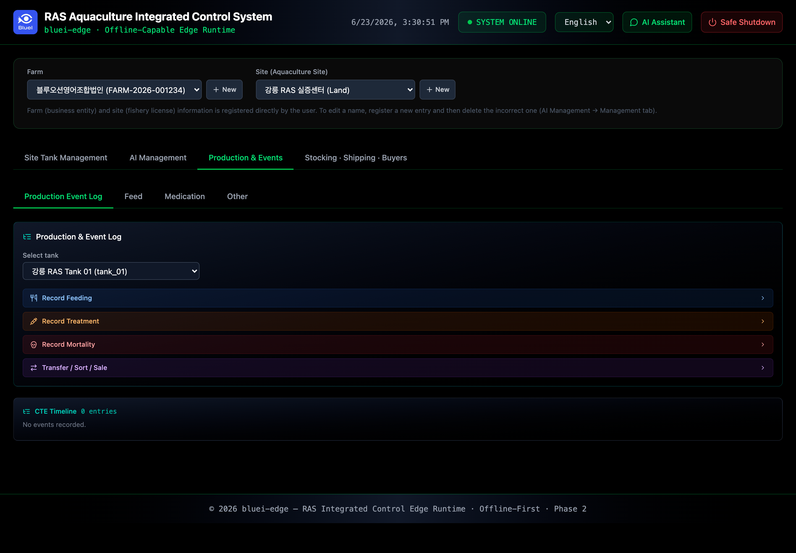

# Production Records & Trade

Two tabs cover record-keeping: **Production & Events** for what happens inside the farm,
and **Stocking · Shipping · Buyers** for what comes in and goes out.

## Production & Events

Open the **Production & Events** tab to log farm events:

- **Mortality** — record dead count for a tank.
- **Treatment (dosing)** — record a treatment, optionally drawing from inventory.
- **Transfer** — move fish between tanks.

Each registration returns a confirmation with an ID (for example a `treatment_id` or
`mortality_id`), and the event is added to the event log for that tank.

## Stocking · Shipping · Buyers

Open the **Stocking · Shipping · Buyers** tab to manage trade records:

- **Stocking** — register an incoming batch (species, count, lots) into one or more tanks.
- **Shipping / Harvest** — register an outgoing batch with counts and lots.
- **Documents** — attach files (fishery licenses, trade statements, invoices) to a stocking
  or shipping record so the paperwork travels with the batch.
- **History** — review stocking and harvest lists with running totals.

> 📸 **SS-19** · Stocking / Shipping with document attachment · _capture pending_ — see [registry](../SCREENSHOTS.md#ss-19)

> ℹ️ Stocking entered here is what activates tanks and enables density and feeding
> calculations — the same stocking step referenced in
> [Initial Setup §6](02-initial-setup.md).

## Inventory & categories

Consumables (for example treatment chemicals) are tracked as inventory and grouped by
category; treatment events can draw down the on-hand quantity.

---

**Navigation:** [← AI Management](04-ai-management.md) · [📖 Contents](../index.md) · [System Operations →](06-system-operations.md)
