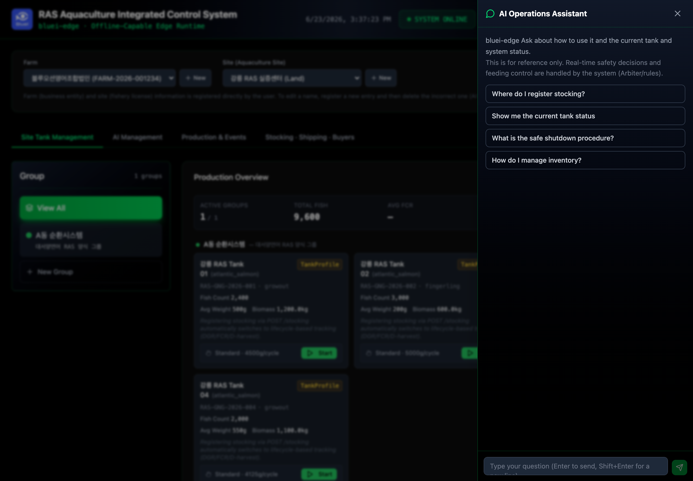
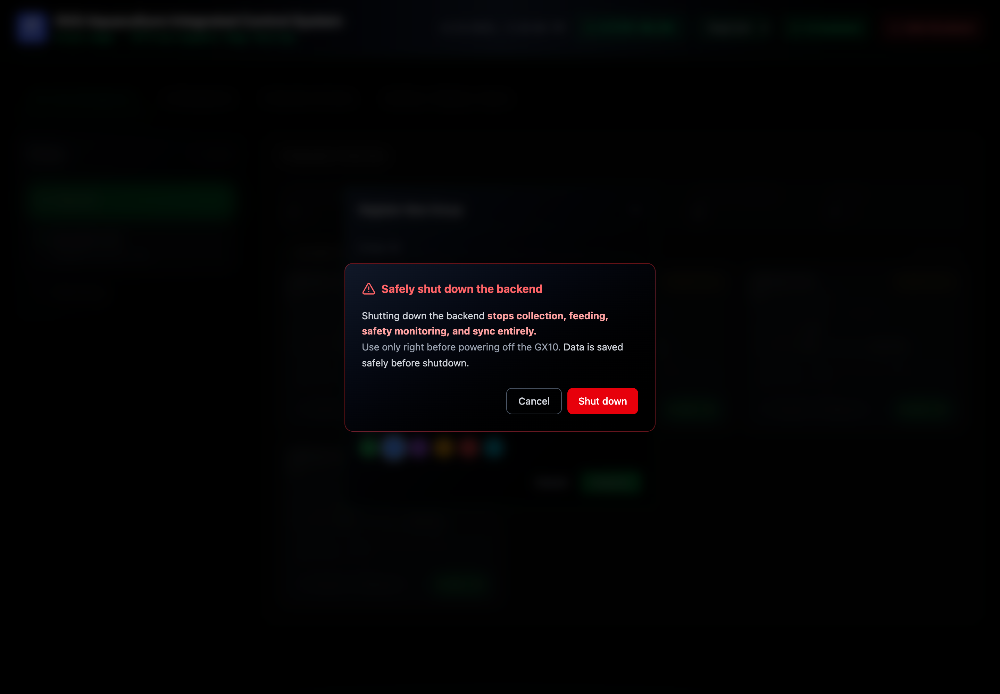

# System Operations

Everyday system-level controls live in the header: the **AI Assistant**, the language
selector, and **Safe Shutdown**.

## AI Assistant

Open it from the header **AI Assistant** button. Use it to ask how the system works and
about current tank/system status; starter prompts are provided to get going.

> ℹ️ The assistant is **advisory**. It helps you understand and navigate the system. It
> does **not** make real-time safety or feeding-control decisions — those are handled by
> the system (rules / arbiter). See [Overview & Safety Principles](00-overview.md).

## Safe Shutdown

> ⚠️ Use **Safe Shutdown only right before powering off the GX10.** It stops collection,
> feeding, safety monitoring, and sync **entirely**. Data is saved safely before shutdown.

1. Header → **Safe Shutdown**.
2. Confirm in the dialog. It shows progress while shutting down.
3. When it reads "shutdown complete — you can power off", it is safe to cut power.
4. To start again later, relaunch the dashboard/runtime (the desktop icon, where the GX10
   has a desktop).

## Offline behavior & sync

bluei-edge is **offline-capable**. It keeps collecting, recording, and applying safety
logic without an internet connection — events are stored locally first and synchronized to
`app.bluei.kr` once connectivity returns.

- **SYSTEM ONLINE** in the header indicates the backend is healthy (this is the local
  runtime, not internet status).
- No operator action is needed for sync; it resumes automatically when the network is back.

## Language

Switch **English / 한국어** with the language selector in the header. The choice is
remembered on that browser. Operator-entered names (farms, sites, groups, tanks) stay as
typed; only system labels translate.

---

**Navigation:** [← Production Records & Trade](05-records-and-trade.md) · [📖 Contents](../index.md) · [Troubleshooting →](07-troubleshooting.md)
